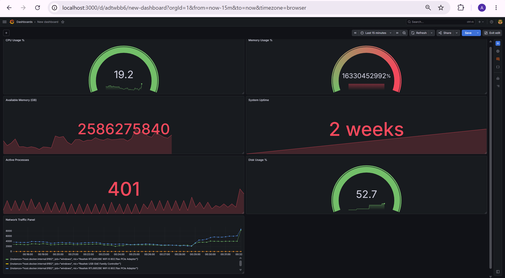
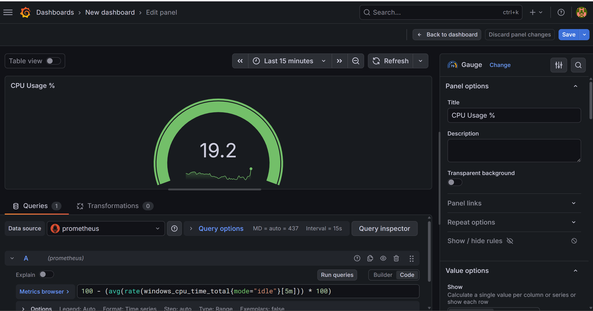
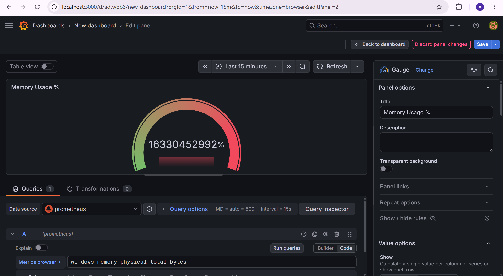

# 🛡️ CyberShield: Infrastructure Monitoring Dashboard

A real-time infrastructure monitoring and observability platform built using **Grafana**, **Prometheus**, and **Windows Exporter**. The project provides visibility into system performance, resource utilization, and overall host health through interactive dashboards and custom PromQL queries.

## 📌 Overview

CyberShield enables proactive monitoring of a Windows system by collecting metrics through Windows Exporter, storing them in Prometheus, and visualizing them with Grafana.

### Architecture

```text
Windows Exporter
       │
       ▼
  Prometheus
       │
       ▼
    Grafana
```

## 🚀 Features

- Real-time CPU monitoring
- Memory utilization tracking
- Available memory monitoring
- System uptime monitoring
- Running processes monitoring
- Custom PromQL queries
- Dockerized deployment
- Interactive Grafana dashboards

## 🛠️ Tech Stack

- Grafana
- Prometheus
- Windows Exporter
- Docker
- PromQL

---

## 📊 Dashboard Preview

### Complete Dashboard



### CPU Usage Monitoring



### Memory Usage Monitoring



---

## 📈 Monitored Metrics

| Metric | Description |
|----------|----------|
| CPU Usage % | Current processor utilization |
| Memory Usage % | Current RAM utilization |
| Available Memory (GB) | Available system memory |
| System Uptime | Time since last system boot |
| Running Processes | Total active processes |

---

## ⚙️ Setup Instructions

### Clone Repository

```bash
git clone https://github.com/<your-username>/CyberShield.git
cd CyberShield
```

### Start Monitoring Stack

```bash
docker compose up -d
```

### Access Services

#### Grafana

```text
http://localhost:3000
```

Default Credentials:

```text
Username: admin
Password: admin
```

#### Prometheus

```text
http://localhost:9090
```

#### Windows Exporter Metrics

```text
http://localhost:9182/metrics
```

---

## 📋 Key Learnings

- Infrastructure monitoring and observability concepts
- Prometheus metrics collection and scraping
- Writing custom PromQL queries
- Grafana dashboard development
- Docker container orchestration
- System performance analysis
- Troubleshooting and metric discovery

---

## 🎯 Future Enhancements

- Disk usage monitoring
- Network traffic visualization
- Alerting and notification workflows
- Multi-host monitoring
- Security-focused dashboards
